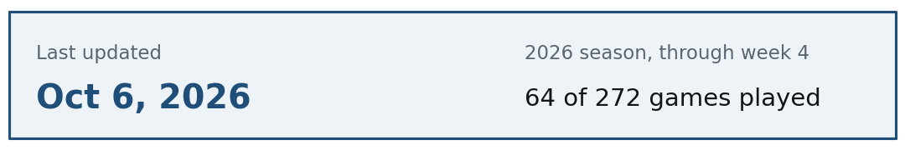
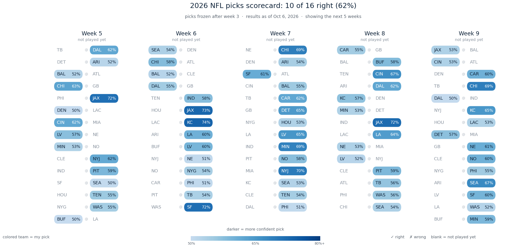

# NFL Pythagorean Expectation



**2026 scorecard:** my picks for the next 5 weeks, made before the games were played. The colored team is my pick, and darker means more confident. Green check = right, red x = wrong, blank = not played yet.



<!-- auto-start -->
**Right now (Oct 6, 2026, through week 4):** 10 of 16 graded picks right (62%). Best playoff odds: AFC KC 93%, JAX 93%, LV 80%; NFC SF 94%, MIN 92%, CHI 85%.
<!-- auto-end -->

Baseball has a formula called the Pythagorean expectation that guesses a team's win percentage from runs scored and runs allowed. I wanted to see if the same idea works for the NFL, and then use it to get playoff odds for this season.

Everything is in one notebook: `NFL Pythagorean Expectation.ipynb`.

## The idea

```
win % = PF^k / (PF^k + PA^k)
```

`PF` is points for, `PA` is points against, and `k` is a number that depends on the sport. If a team scores and allows the same amount it comes out to 50%, and the more it outscores opponents the closer it gets to 100%. `k` controls how fast that happens. Baseball's is about 1.83, and the number people usually quote for the NFL is 2.37. I fit my own using every regular-season game from 1999 to 2025 (data from `nfl_data_py`).

## How I fit `k`

Take the log of both sides and the formula turns into a straight line: `logit(win %) = k * log(PF / PA)`. So `k` is just the slope, and I get it with a logistic regression over all 861 team-seasons (each one weighted by games played). Ties count as half a win.

I also tried adding an intercept, in case teams with equal points for and against don't land at exactly 50%. It came out around zero (0.013, p = 0.48), so I left it out.

## What I found

- **k = 2.67**, with a 95% range of 2.57 to 2.77 (from resampling the data 500 times). The usual 2.37 falls outside that range.
- **It works on seasons it hasn't seen.** Fitting on 1999-2019 and predicting 2020-2025, it's off by about 1.1 wins per team. Guessing everyone at 8.5 wins is off by about 2.7.

| Model | Avg. miss (wins) |
|---|---|
| My fitted k | 1.11 |
| k = 2.37 | 1.16 |
| k = 1.83 (baseball) | 1.36 |
| Everyone at .500 | 2.66 |

- **Luck matters a lot.** How far a team beats or misses its expected wins one year says basically nothing about the next year (correlation 0.003).
- **Luckiest teams:** 2024 Chiefs (15 wins vs. about 10.4 expected), 2022 Vikings (13 vs. 8.4), 2012 Colts (11 vs. 7.1).

## Playoff odds for the current season

The last section of the notebook plays the rest of the season out 10,000 times.

1. Give each team a rating, `k * log(PF / PA)`, from its points so far. A few games in, that's noisy, so I mix in 8 pretend games where the team scored and allowed exactly the league average.
2. Turn ratings into a win chance for each remaining game. The chance a team wins is the logistic of the difference in ratings, plus a home-field bump based on how often home teams have won since 1999 (about 56%).
3. Simulate every remaining game, add up wins, and seed 7 teams per conference (4 division winners and 3 wild cards).

It writes the results to `playoff_odds_2026.csv`.

**Limits:** ratings stay fixed during the simulation, ties in the standings are broken randomly instead of with the real NFL tiebreakers, and it knows nothing about injuries or quarterbacks. Early in the season it's built on very few games, so take it lightly until around week 8. I haven't tested the game-by-game win chances against past games; that part is a reasonable setup, not a checked one.

## Every remaining game, predicted (and graded)

The last sections of the notebook make one picture with a predicted winner and win chance for every game left this season (weeks 4-18), using the same ratings and win chances as the playoff odds. In the full picture bold is my pick; in the scorecard the pick is the colored team. Either way, darker means more confident.

As games get played, I grade the picks with a green check (right) or a red x (wrong). The scorecard at the top shows the current week plus the next four so it's easy to read, and it moves forward as weeks finish. The full 15-week version is `predictions_2026_thru_week3.png`.

The graded picture is at the top of this page.

The picks themselves are frozen in `predictions_2026_thru_week3.csv` (and the ungraded picture, `predictions_2026_thru_week3.png`), so the grading always uses what I predicted before the games, not a redo. **After the season ends I'll do the full comparison**: how many I got right (the model's backtest accuracy was about 60%, so that's the bar), whether the 70%+ picks hit more often than the toss-ups, and how the playoff odds lined up with who really made it.

## How to run it

You need Python 3.9+ and internet (it downloads the data).

```bash
python3 -m venv .venv
source .venv/bin/activate
pip install pandas numpy statsmodels matplotlib nfl_data_py jupyter
jupyter notebook "NFL Pythagorean Expectation.ipynb"
```

Run all the cells. Game results come from `nfl_data_py`, which can lag a day or so, so the notebook tops them up with final scores from ESPN's public scoreboard feed (the data behind espn.com/nfl/schedule). If ESPN can't be reached it just uses `nfl_data_py`. Rerunning it during the season updates the odds with the latest games. The badge at the top of this README is regenerated on every run, so it always shows when the numbers were last refreshed.
